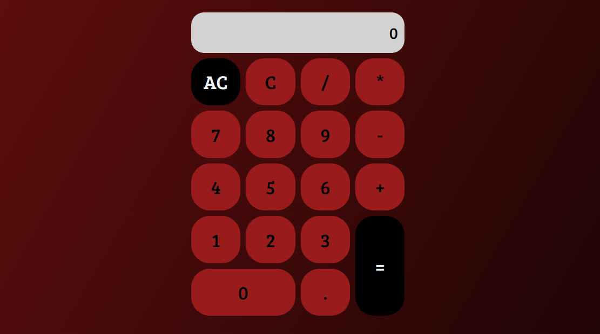

# Calculadora Web



Uma calculadora web simples e elegante desenvolvida utilizando HTML, CSS e JavaScript. Este projeto é uma demonstração prática de como criar uma interface de usuário interativa e funcional para realizar operações matemáticas básicas.

## Visão Geral
Este projeto é uma calculadora que permite realizar operações matemáticas fundamentais como adição, subtração, multiplicação e divisão. A aplicação foi projetada para ser intuitiva e fácil de usar, com uma interface limpa e responsiva.

## Funcionalidades
**Operações Básicas:** Realiza adição, subtração, multiplicação e divisão.
**Interface Intuitiva:** Layout claro com botões bem definidos.
**Responsividade:** Funciona bem em diferentes tamanhos de tela.
**Feedback Visual:** Mostra a operação e o resultado de forma clara.
Tecnologias Utilizadas
**HTML:** Estrutura da página.
**CSS:** Estilização e design responsivo.
**JavaScript:** Lógica da calculadora e manipulação de eventos.

## Como Executar
Clone o Repositório:
```bash
git clone https://github.com/EvillyCosta/calculator-project.git
